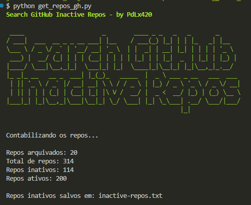

# Search GitHub Inactive Repos - by PdLx420

Este script Python lista repositórios inativos em uma organização do GitHub, verificando se não houve commits nos últimos 180 dias e salvando os repositórios inativos em um arquivo de texto.

## Requisitos

- Python 3.x
- Bibliotecas Python:
  - requests
  - pyyaml
  - termcolor
  - urllib3

Você pode instalar as bibliotecas necessárias usando o comando:

```bash
pip install -r requirements.txt
```

## Configuração
Antes de executar o script, você precisa editar o arquivo config.yaml com o seguinte formato:

```yaml
github_token: 'seu_token_github'
org_name: 'nome_da_organizacao'
```

- `github_token`: Seu token de acesso do GitHub. Você pode gerar um token de acesso pessoal em [GitHub Settings](https://github.com/settings/tokens).
- `org_name`: Nome da organização no GitHub da qual você deseja listar os repositórios.

Para alterar a quantidade de dias sem commit, basta alterar a seguinte variável:

```python
days_without_commit = 180
```

## Uso
Execute o script usando o comando:

```bash
python search_inactive_repos.py
```

## Exemplo do resultado


## Agradecimento pela contribuição

- Janaina Centini - https://github.com/yabadabaduca

## Referências

- https://github.com/0xtiago/GithubCommittersSpy
- https://docs.github.com/pt/rest?apiVersion=2022-11-28
